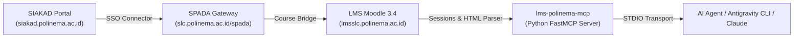

# LMS Polinema MCP (`lms-polinema-mcp`)

[](https://opensource.org/licenses/MIT)
[](https://www.python.org/downloads/)
[](https://modelcontextprotocol.io)

Model Context Protocol (MCP) server yang memberikan AI Agents (Antigravity CLI, Claude Desktop, Cursor, VS Code) akses penuh dan real-time ke **LMS Polinema** (`lmsslc.polinema.ac.id` & `slc.polinema.ac.id/spada`).

Didesain sebagai **reference implementation** untuk sistem akademik kampus dengan autentikasi multi-tier (SIAKAD Portal ➔ SPADA ➔ LMS Moodle).

---

## 🏛️ Arsitektur Integrasi

Kampus Polinema mengadopsi struktur multi-tier di mana autentikasi mahasiswa berpusat di SIAKAD:



1. **SIAKAD Portal**: Titik awal autentikasi (NIM & Password).
2. **SPADA Gateway**: Mengelola discovery mata kuliah aktif semester berjalan.
3. **LMS Moodle**: Menyimpan modul, jobsheet, tugas (assignments), dan sistem pengumpulan.
4. **`lms-polinema-mcp`**: Mengorkestrasi sesi `POLIMASPADA` dan `MoodleSession` untuk menyajikan data secara terstruktur ke AI Agent.

---

## 🛠️ Daftar Tools yang Tersedia

| Tool Name | Parameter | Deskripsi |
|---|---|---|
| `lms_list_courses` | - | Mengambil seluruh mata kuliah aktif semester ini beserta link dan ID LMS |
| `lms_list_assignments` | `course_id?` (optional) | Menampilkan seluruh tugas aktif dari semua mata kuliah (atau filter per mapel) |
| `lms_get_assignment_detail` | `assignment_id` (required) | Mengambil deskripsi lengkap tugas, lampiran file, batas waktu, dan status submission |
| `lms_list_materials` | `course_id` (required) | Menampilkan semua slide materi, jobsheet, dan modul per pertemuan |
| `lms_check_deadlines` | - | Merekap tugas-tugas aktif dengan deadline terdekat dan sisa waktu pengumpulan |

---

## 🚀 Instalasi & Setup

### 1. Prasyarat
- Python 3.11+
- Package manager [`uv`](https://astral.sh/uv) (disarankan) atau `pip`

### 2. Clone & Install Dependencies
```bash
git clone https://github.com/hafidzrafi/lms-polinema-mcp.git
cd lms-polinema-mcp

# Install dependencies menggunakan uv
uv sync
uv run playwright install chromium
```

### 3. Autentikasi Sesi (Sekali Saja)
Jalankan script interaktif untuk melakukan handshake SSO:
```bash
uv run python auth.py
```
Masukkan NIM dan Password SIAKAD. Browser Chromium otomatis masuk ke SIAKAD ➔ membuka menu Akademik > LMS ➔ mengklik *Connect to LMS Polinema* ➔ dan menyimpan sesi ke `~/.lms_polinema/`.

---

## ⚙️ Konfigurasi MCP Client

### Antigravity CLI / AGY (`~/.gemini/config/mcp_config.json`)
```json
{
  "mcpServers": {
    "lms-polinema": {
      "command": "/Users/<username>/Projects/03_AI_Automation/mcp-servers/lms-polinema-mcp/.venv/bin/python",
      "args": ["-m", "lms_polinema_mcp.server"]
    }
  }
}
```

### Claude Desktop (`~/Library/Application Support/Claude/claude_desktop_config.json`)
```json
{
  "mcpServers": {
    "lms-polinema": {
      "command": "/absolute/path/to/lms-polinema-mcp/.venv/bin/python",
      "args": ["-m", "lms_polinema_mcp.server"]
    }
  }
}
```

### Cursor (`~/.cursor/mcp.json`)
```json
{
  "mcpServers": {
    "lms-polinema": {
      "command": "/absolute/path/to/lms-polinema-mcp/.venv/bin/python",
      "args": ["-m", "lms_polinema_mcp.server"]
    }
  }
}
```

---

## 💡 Adaptasi untuk Kampus Lain (Forking Guide)

Jika kampus kamu memiliki arsitektur serupa (Portal Kampus + Moodle LMS):
1. Sesuaikan endpoint URL di `src/lms_polinema_mcp/config.py`:
   - Ganti `SIAKAD_BASE_URL` dan `MOODLE_BASE_URL`
2. Sesuaikan selector navigasi di `auth.py` sesuai alur klik portal kampus kamu.
3. Core parsing Moodle (`LMSClient`) langsung bekerja karena struktur DOM Moodle bersifat standar.

---

## 📄 Lisensi
MIT License © 2026 [Hafidz Rafi Rabbani](https://github.com/hafidzrafi).
