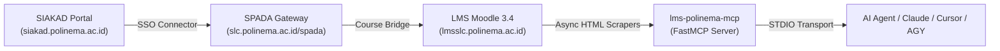

# LMS Polinema MCP Server (`lms-polinema-mcp`)

[](https://opensource.org/licenses/MIT)
[](https://www.python.org/downloads/)
[](https://modelcontextprotocol.io)
[](#cross-platform-support)
[](https://github.com/hafidzrafi/lms-polinema-mcp/actions/workflows/ci.yml)

A high-performance Model Context Protocol (MCP) server that provides AI agents (Antigravity CLI, Claude Desktop, Cursor, VS Code) real-time access to **LMS Polinema** (`lmsslc.polinema.ac.id` & `slc.polinema.ac.id/spada`).

Designed as an open-source reference implementation for university academic systems featuring multi-tier Single Sign-On (SSO) authentication.

---

## Architecture Overview

Polinema employs a multi-tier authentication chain where student accounts authenticate via the university portal (SIAKAD) rather than native Moodle accounts:



1. **SIAKAD Portal:** Primary identity provider (NIM & Password).
2. **SPADA Gateway:** Discovers active enrolled semester courses.
3. **Moodle LMS:** Hosts course modules, jobsheets, assignments, and submission deadlines.
4. **Self-Healing Layer:** Automatically triggers headless browser re-authentication when session cookies expire, providing a zero-interruption experience for AI agents.

---

## Tool Reference

| Tool Name | Parameters | Description |
|---|---|---|
| `lms_list_courses` | _(none)_ | Retrieves all enrolled courses for the active semester with LMS course IDs and URLs. |
| `lms_list_assignments` | `course_id` _(optional int)_ | Lists active assignments across all courses or filtered by course ID. |
| `lms_get_assignment_detail` | `assignment_id` _(required int)_ | Returns full instructions, attachment files, submission status, and deadline details. |
| `lms_list_materials` | `course_id` _(required int)_ | Lists course slides, jobsheet documents, and lecture resources. |
| `lms_check_deadlines` | _(none)_ | Fetches upcoming assignment deadlines across all courses in parallel. |

---

## Cross-Platform Support

This package is **100% cross-platform** and runs natively on:
- **macOS** (Apple Silicon & Intel)
- **Linux** (Ubuntu, Debian, Fedora, Arch, WSL2)
- **Windows 10 / 11** (PowerShell, Command Prompt, or WSL)

Path resolution uses Python's `pathlib.Path.home()` and file permissions are safely guarded with fallback handlers across OS platforms.

---

## Installation & Setup

### 1. Prerequisites
- Python 3.11 or higher
- [`uv`](https://astral.sh/uv) (recommended) or `pip`

### 2. Install Dependencies
```bash
git clone https://github.com/hafidzrafi/lms-polinema-mcp.git
cd lms-polinema-mcp

# Sync dependencies and install Playwright Chromium
uv sync
uv run playwright install chromium
```

### 3. Interactive Authentication Setup (One-Time)
Run the setup script to store your credentials and establish your initial session:
```bash
uv run python auth.py
```
Your credentials are stored as JSON with user-only file permissions (`0600`) at `~/.lms_polinema/credentials.json`. When sessions expire, the server re-authenticates automatically in the background.

---

## MCP Client Configuration

### Universal Configuration (Works across all OS platforms via `uv`)

```json
{
  "mcpServers": {
    "lms-polinema": {
      "command": "uv",
      "args": [
        "run",
        "--directory",
        "/absolute/path/to/lms-polinema-mcp",
        "lms-polinema-mcp"
      ]
    }
  }
}
```

### macOS / Linux Direct Binary Configuration

```json
{
  "mcpServers": {
    "lms-polinema": {
      "command": "/absolute/path/to/lms-polinema-mcp/.venv/bin/python",
      "args": ["-m", "lms_polinema_mcp.server"]
    }
  }
}
```

### Windows Direct Binary Configuration

```json
{
  "mcpServers": {
    "lms-polinema": {
      "command": "C:\\path\\to\\lms-polinema-mcp\\.venv\\Scripts\\python.exe",
      "args": ["-m", "lms_polinema_mcp.server"]
    }
  }
}
```

---

## Configuration Overrides

All settings can be customized via environment variables or a `.env` file:

| Environment Variable | Default | Description |
|---|---|---|
| `LMS_POLINEMA_HTTP_TIMEOUT` | `20.0` | HTTP request timeout in seconds |
| `LMS_POLINEMA_COURSE_CACHE_TTL_SECONDS` | `1800` | In-memory course listing cache lifetime (30m) |
| `LMS_POLINEMA_SESSION_CACHE_TTL_SECONDS` | `300` | In-memory session validation check cache (5m) |
| `LMS_POLINEMA_SIAKAD_BASE_URL` | `https://siakad.polinema.ac.id` | SIAKAD portal URL |
| `LMS_POLINEMA_MOODLE_BASE_URL` | `https://lmsslc.polinema.ac.id` | University Moodle base URL |

---

## Adapting for Other Universities (Forking Guide)

1. **Update URLs:** Modify endpoints in `src/lms_polinema_mcp/config.py` or provide them via `.env`.
2. **Update Auth Navigation:** Customize selector logic in `src/lms_polinema_mcp/auth/refresh.py` to match your university's SSO button clicks.
3. **Moodle Scraper Reusability:** The `MoodleScraper` in `src/lms_polinema_mcp/services/moodle.py` uses standard Moodle DOM selectors (`.generaltable`, `/mod/assign/`, `#intro`), making it portable across any Moodle 3.x–4.x installation.

---

## License

MIT License © 2026 [Hafidz Rafi Rabbani](https://github.com/hafidzrafi).
